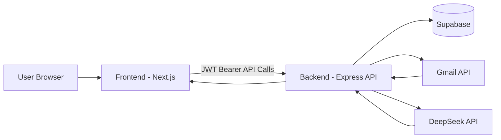
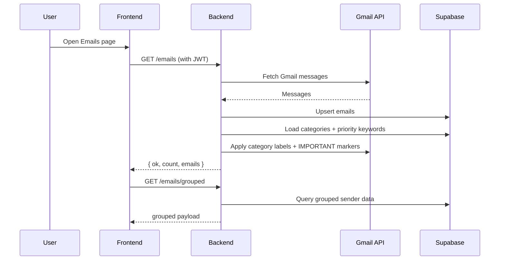
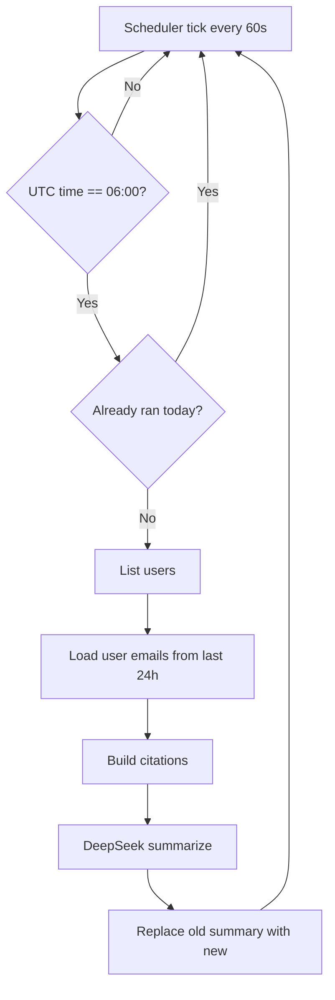

# <p align="center">Magic Mail</p>

<p align="center">
  
</p>

<p align="center">
  AI-powered inbox operations platform for Gmail: unsubscribe, rollup, categorization, priority marking, and daily summaries.
</p>

---

## Overview

Magic Mail is a full-stack application that helps users manage high-volume inboxes by combining Gmail API automation, Supabase persistence, and AI-powered summarization.

Core capabilities:

- Google OAuth login
- Fetch and persist user emails
- Group emails by sender/domain
- Unsubscribe using available unsubscribe links
- Delete sender emails in bulk
- Rollup sender emails into Gmail labels
- Create custom categories and auto-label matching emails
- Define priority keywords and auto-mark matching emails as `IMPORTANT`
- Generate one daily AI summary per user (DeepSeek), refreshed at 06:00 UTC

---

## System Design

### High-Level Architecture

- Frontend: Next.js App Router (`frontend/`)
- Backend API: Express + TypeScript (`backend/`)
- Persistence: Supabase (`users`, `emails`, `subscriptions`, `daily_summaries`, `categories`, `priority_keywords`)
- Identity/Auth:
  - Google OAuth for account linking
  - JWT for API authorization
- External Integrations:
  - Gmail API (`googleapis`)
  - DeepSeek API for daily summary generation

### Data Flow (Typical)

1. User authenticates via Google OAuth.
2. Backend stores/updates user tokens in Supabase.
3. Frontend calls backend with JWT bearer token.
4. Backend fetches Gmail messages and persists normalized records.
5. Backend applies automations:
   - categories -> Gmail labels
   - priority keywords -> Gmail `IMPORTANT`
6. UI pages fetch and display real data from backend.
7. Daily summary scheduler generates one latest summary per user at 06:00 UTC.

### Architecture Diagrams

#### 1) High-Level System Architecture



#### 2) Email Sync + Automation Flow



#### 3) Daily Summary Scheduler Flow (06:00 UTC)



---

## Repository Structure

```text
freemymail/
├─ backend/
│  ├─ src/
│  │  ├─ config/
│  │  ├─ controllers/
│  │  ├─ middlewares/
│  │  ├─ repositories/
│  │  ├─ routes/
│  │  └─ services/
│  ├─ package.json
│  └─ .env
├─ frontend/
│  ├─ app/
│  ├─ components/
│  ├─ sass/
│  ├─ public/
│  └─ package.json
├─ package.json
└─ README.md
```

---

## Tech Stack

### Frontend

- Next.js 16
- React 19
- TypeScript
- Redux Toolkit + Redux Persist
- SCSS

### Backend

- Node.js + Express 5
- TypeScript
- Supabase JS SDK
- Google APIs SDK
- JWT
- Morgan/CORS
- DeepSeek API integration

---

## Prerequisites

- Node.js 18+ (recommended 20+)
- npm
- Google Cloud OAuth credentials
- Supabase project
- DeepSeek API key (for AI daily summary)

---

## Installation

From project root:

```bash
npm install
```

Install backend and frontend dependencies:

```bash
cd backend && npm install
cd ../frontend && npm install
```

---

## Environment Variables

Create `backend/.env` with:

```env
PORT=7000

SUPABASE_URL=
SUPABASE_SERVICE_ROLE_KEY=

GOOGLE_CLIENT_ID=
GOOGLE_CLIENT_SECRET=
GOOGLE_REDIRECT_URI=http://localhost:7000/auth/google/callback

JWT_SECRET=

STRIPE_SECRET_KEY=

DEEPSEEK_API_KEY=

SMTP_HOST=
SMTP_PORT=587
SMTP_USER=
SMTP_PASS=

REDIS_URL=
FRONTEND_URL=http://localhost:3000
```

Create `frontend/.env.local` with:

```env
NEXT_PUBLIC_BACKEND_URL=http://localhost:7000
```

---

## Database Schema (Supabase)

At minimum, ensure these tables exist:

- `users`
- `emails`
- `subscriptions`
- `daily_summaries`
- `categories`
- `priority_keywords`

The app expects:

- `daily_summaries`: one latest summary per user (old replaced on new generation)
- `categories`: user label + description + extracted keywords + matched email count
- `priority_keywords`: keyword list used to mark matched emails as Gmail `IMPORTANT`

If using RLS, add policies allowing users to access only their own rows.

---

## Running the App

### Backend (development)

```bash
cd backend
npm run dev
```

### Frontend (development)

```bash
cd frontend
npm run dev
```

App URLs:

- Frontend: `http://localhost:3000`
- Backend: `http://localhost:7000` (or your configured `PORT`)

---

## Build & Production

### Backend

```bash
cd backend
npm run build
npm run start
```

### Frontend

```bash
cd frontend
npm run build
npm run start
```

---

## Backend API Surface (Current)

### Auth

- `GET /auth/google/url`
- `GET /auth/google/callback`
- `GET /auth/me`

### Emails

- `GET /emails` (fetch + save + apply automations)
- `GET /emails/grouped`
- `GET /emails/by-sender?sender=...`
- `POST /emails/unsubscribe`
- `POST /emails/rollup`
- `POST /emails/delete`

### Categories

- `GET /emails/categories`
- `POST /emails/categories`
- `DELETE /emails/categories/:id`

### Priority

- `GET /emails/priority-keywords`
- `POST /emails/priority-keywords`
- `DELETE /emails/priority-keywords/:id`

### Daily Summary

- `GET /daily-summary/latest`
- `POST /daily-summary/regenerate`

---

## Feature Behavior

### Rollup

- Creates/uses a Gmail label named by sender.
- Applies that label to sender emails.
- Removes `INBOX` label (archives).

### Delete

- Permanently deletes selected Gmail messages via batch operation.

### Unsubscribe

- Uses unsubscribe link from selected/sender emails when available.

### Categories

- User creates category label + description.
- Backend extracts keywords from description.
- Emails matching keywords in sender/subject/snippet are labeled in Gmail.

### Priority

- User adds priority keyword.
- Matching emails are marked with Gmail system label `IMPORTANT`.

### Daily Summary

- Generated from last 24h emails.
- Uses DeepSeek to create citation-aware summary text.
- Scheduled at 06:00 UTC.
- Old summary removed; only latest summary retained per user.

---

## Security Notes

- Never commit real secrets (`.env`, service role keys, OAuth secrets).
- Keep JWT secret strong and private.
- Restrict CORS origins for production domains.
- Use HTTPS in production for frontend/backend and OAuth redirect URIs.

---

## Troubleshooting

- `403` on Gmail mutations (rollup/delete):
  - Re-login with Google and re-consent required scopes.
- No daily summary:
  - Check `DEEPSEEK_API_KEY`
  - Verify `daily_summaries` table exists
  - Call `POST /daily-summary/regenerate` manually
- Frontend build error about `nprogress`:
  - Add/install `nprogress` or remove unused import in `components/progressBar.tsx`.

---

## Project Name

**Magic Mail**

